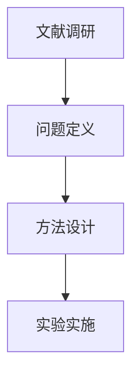

# 绘图工具（Text → IR → Diagram）

## Native-First Policy

**Codex-native first**：普通流程图、架构图、关系图和演示用示意图，优先由 Codex 直接生成 Mermaid、DOT、SVG 或宿主支持的图片。只有需要从 ScholarAIO 论文库提取结构、保存 IR、批量复现或生成可继续编辑的 drawio 文件时，才调用 `scholaraio diagram`。不要为普通绘图安装额外 Python 绘图库。

`draw` skill 的核心工作流是**两步式**：先将文字描述或论文内容转换为统一的中间表示（IR），再将 IR 渲染为多种可编辑格式。

## 后端选择速查表

| 需求 | 推荐后端 | 输出格式 | 特点 |
|------|----------|----------|------|
| 快速画流程图/架构图，零依赖预览 | **Mermaid** | `.mermaid` / 嵌入 Markdown | 文本即代码，GitHub/Obsidian/Claude Code 原生渲染 |
| 论文插图，LaTeX Beamer 直插 | **Graphviz SVG** | `.svg` + `.dot` 源码 | 矢量图，可版本控制，`<?xml>` 级精确 |
| 在线协作/精调布局 | **drawio** | `.drawio` XML | 导入 [diagrams.net](https://app.diagrams.net) 后手动拖拽调整 |
| 自定义实验示意图、信息图 | **Codex 直接生成 SVG/图片** | `.svg` / `.png` | 普通场景零新增 Python 依赖 |
| 程序化批处理、版本控制 | **Graphviz DOT** | `.dot` | 纯文本，Diff 友好，任何平台可编译 |

## 工作流架构

```
┌─────────────┐     extract_diagram_ir()      ┌────────────┐
│  文字描述    │  ────────────────────────────> │     IR     │
│  或论文全文  │                               │  {nodes,   │
└─────────────┘                               │   edges,   │
                                              │   layout}  │
                                              └─────┬──────┘
                                                    │ render_ir(fmt)
              ┌─────────────────────────────────────┼─────────────────────────────────────┐
              ▼                                     ▼                                     ▼
        ┌──────────┐                          ┌──────────┐                        ┌──────────┐
        │  Mermaid │                          │   SVG    │                        │  drawio  │
        │ flowchart│                          │ (Graphviz│                        │  XML     │
        └──────────┘                          └──────────┘                        └──────────┘
```

- **IR（Intermediate Representation）**：标准化 JSON，包含 `title`、`nodes[]`、`edges[]`、`layout_hint`
- **提取**：可由 LLM 从论文 Method/Architecture 章节自动提取，也可由用户直接提供文字描述后调用 LLM 生成 IR
- **渲染**：通过 `render_ir(ir, fmt)` 分发到注册的后端，完全解耦

## 使用方式

### 方式 1：从论文自动生成（调用 diagram CLI）

```bash
# 提取论文中的模型架构，渲染为 SVG
scholaraio diagram <paper-id> --type model_arch --format svg

# 只提取 IR，保存 JSON 供后续二次渲染
scholaraio diagram <paper-id> --type model_arch --dump-ir

# 从已有 IR 渲染为 drawio
scholaraio diagram --from-ir workspace/_system/figures/xxx.ir.json --format drawio

# 启用 Critic-Agent 闭环迭代自审（自动检查完整性、准确性、一致性并修正）
scholaraio diagram <paper-id> --type model_arch --format svg --critic

# 指定 Critic 最大迭代轮次（默认 3 轮）
scholaraio diagram <paper-id> --type model_arch --format svg --critic --critic-rounds 2
```

### 方式 2：从文字描述生成 IR 再渲染

当用户给出一段文字描述（如研究流程、实验设计）时：

1. 调用 LLM 将描述转换为 IR JSON
2. 使用 `render_ir()` 或 `scholaraio diagram --from-ir` 生成目标格式

### 方式 3：Mermaid 零依赖渲染

若用户只需要快速预览流程图，直接在 Markdown 中写 Mermaid 语法即可：

```markdown

```

Codex 和支持 Mermaid 的宿主可直接预览，无需任何 Python 渲染依赖。

## 各后端详细用法

### Graphviz DOT / SVG

需要系统安装 Graphviz 的 `dot`；如要插入 Beamer SVG，也要安装 Inkscape。可先用
`scholaraio setup check` 查看 `Graphviz dot` 与 `Inkscape` 状态。

```bash
# Ubuntu/Debian
sudo apt-get install graphviz inkscape

# macOS
brew install graphviz
brew install --cask inkscape

# conda 环境只需要 DOT/SVG 渲染时
conda install -c conda-forge graphviz

# 验证
dot -V
inkscape --version
```

生成 SVG（同时保留 `.dot` 源码）：

```bash
scholaraio diagram <paper-id> --format svg -o workspace/_system/figures/
```

完整 Graphviz DOT/SVG 工作流见 `docs/writing-guide/graphviz-guide.md`。

LaTeX Beamer 插入代码（需 `-shell-escape` + Inkscape）：

```latex
\begin{frame}
\centering
\includesvg[width=0.8\columnwidth]{workspace/_system/figures/diagram_xxx.svg}
\end{frame}
```

### drawio XML

```bash
scholaraio diagram <paper-id> --format drawio -o workspace/_system/figures/
```

用浏览器打开 [https://app.diagrams.net](https://app.diagrams.net) 后选择 **File → Open from → Device** 导入编辑。

### Mermaid

```bash
scholaraio diagram <paper-id> --format mermaid -o workspace/_system/figures/
```

输出 `.mermaid` 文件，可直接嵌入 Markdown 或用 `mmdc` 本地渲染为 PNG/SVG。

## 执行逻辑

1. **判断输入来源**：
   - 用户提供了论文 ID → 调用 `scholaraio diagram` 提取 + 渲染
   - 用户提供了文字描述 → LLM 生成 IR → `render_ir()`
   - 用户已有 Mermaid 代码 → 直接嵌入 Markdown 或转 IR 后多格式输出

2. **选择后端**：参照上方「后端选择速查表」，根据用户的最终使用场景推荐格式

3. **输出到 `workspace/_system/figures/`**：
   ```
   workspace/_system/figures/
   ├── diagram_xxx.svg
   ├── diagram_xxx.dot
   ├── diagram_xxx.drawio
   └── diagram_xxx.mermaid
   ```

4. **提示嵌入方式**：SVG → Beamer `\includesvg`；drawio → diagrams.net 导入；Mermaid → Markdown 嵌入

## 示例

用户说："画一个我的研究流程图"
→ 若已有论文：提取 Method → IR → SVG
→ 若无论文：根据描述生成 IR → Mermaid flowchart

用户说："帮我画一个实验装置示意图"
→ Codex 直接生成可编辑 SVG；只在用户明确需要照片式或插画式结果时使用宿主图片生成能力

用户说："把这个 Mermaid 代码转成 SVG"
→ 解析为 IR → `render_ir(ir, "svg")`

用户说："把这篇论文的模型架构画成可编辑的图"
→ `scholaraio diagram <paper-id> --type model_arch --format drawio`
